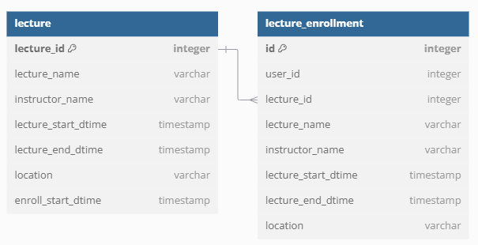

## 요구사항 분석
### 📌 특강 신청 API : `POST /lectures`

- 특강 신청 기간이 아닌 특강에는 신청할 수 없다.
- 사용자는 이미 신청한 특강에 신청할 수 없다.
- 신청자가 30명이 넘은 특강을 신청하면 실패한다.
- 사용자가 특강에 정상적으로 신청이 된다.

### 📌 특강 신청 가능 목록 API : `GET /lectures`

- 특강 신청 일자 이전인 특강 목록은 조회 되지 않는다.
- 특강 일시가 오늘 이전인 특강은 조회 되지 않는다.
- 특강 신청 가능 목록이 조회 된다.

### 📌 특강 신청 완료 목록 조회 API : `GET /lectures/enrollments`

- 사용자 아이디를 통해 신청이 완료된 특강 목록을 조회한다.
- 특강을 신청하지 않은 사용자가 조회 시 빈 목록이 조회된다.

## ERD

📌 **강의(lecture)** 테이블은 강의에 대한 정보를 가지고 있습니다.
- lecture_id : 강의를 식별할 수 있는 아이디
- lecture_name : 강의 이름
- instructor_name : 강의자 이름
- lecture_start_dtime : 강의 시작 일시
- lecture_end_dtime : 강의 종료 일시
- location : 강의 장소
- enroll_start_dtime : 강의 신청 시작 일시

📌 **강의 신청(lecture_enrollment)** 테이블은 사용자가 신청한 강의 정보를 가지고 있습니다.
신청 당시의 강의 정보를 담고 있어서 추후에 강의 정보가 변경되어도 신청 시의 정보를 확인할 수 있습니다.
- id : 강의 신청을 식별하는 아이디
- lecture_id : 신청한 강의 아이디
- user_id : 신청한 사용자 아이디

📌 사용자에 관련된 로직은 구현하지 않으므로 사용자 테이블은 생략하였습니다.
